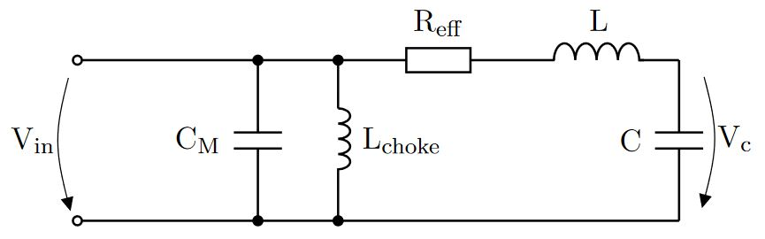
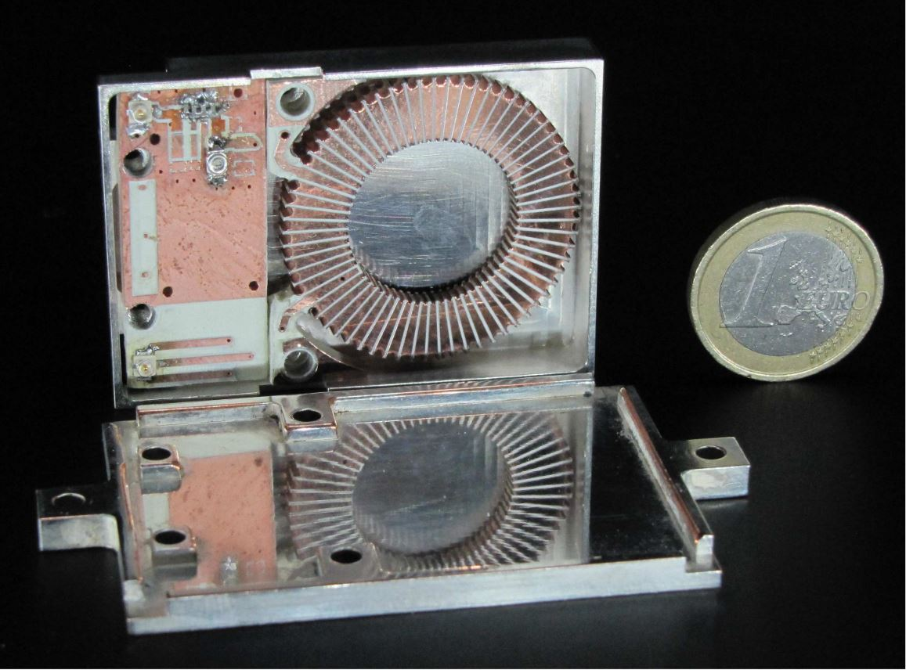

# Innsbruck high-temperature superconducting resonator

## Contributors
### Original work
Matthias F. Brandl, Martin van Mourik, Philipp Schindler, Thomas Monz, Rainer Blatt
### Article contributors
- Author: Philip Holz
- Reviewer: Thomas Monz, Philipp Schindler

## Application
For the operation of ion traps in a cryogenic environment, a crucial aspect is the thermal load to the cryostat. Reducing the thermal load typically requires the usage of cabling with a low thermal conductivity, which also entails low electric conductivity (Wiedemann-Franz law). Such cabling, if part of the resonant RF circuit driving the ion trap, would severely limit the quality factor of the RF resonator, and lead to excess heat dissipation. A solution to this problem is to operate a low-loss resonator within the vacuum, directly at the cold stage, where wires with a high conductivity can be used. In that way, also the capacitive load of the resonator is minimized, leading to a smaller charging current and increasing the resonator's voltage gain. The latter decreases the required drive amplitude, further minimizing the heat dissipation.

The Innsbruck high-temperature superconducting (HTS) resonator uses a spiral coil made from the high-temperature superconductor yttrium barium copper oxide (YBCO). The coil is patterned out of a YBCO film coated onto a sapphire substrate, and is mounted within a grounded enclosure to shield trapped ions from the generated RF magnetic fields. The coil has an inductance of about 1.4 µH and becomes superconducting for temperatures $$T<88\,$$K, with a measured quality factor $$Q=1172(241)$$ at $$\omega_0=2\pi\times44.3\,$$MHz.

## Background
The HTS coil was designed, wired up and tested by Matthias Brandl at Innsbruck University in 2015 [[1,2]](#references). The main aim was to create a resonator coil that can be reproducibly manufactured and which minimizes RF losses to maximize the resonator's quality factor $$Q$$, and thus the voltage gain $$G_V$$. The rationale behind that is that RLC tank resonators used for ion traps are typically limited by the Ohmic losses in the coil wire.

## Legal status
- Source of information:
  - Publication, see [References](#references) below
  - Personal communication with Martin van Mourik (2021)
- Copyright/Intellectual property: Public domain

## Specifications
Note: For some quantities, no uncertainties could be found in the source of information.

### Electrical

|    | targeted | achieved |
|----|----------|----------|
| inductance $$L$$ | 1.3 µH - 2.6 µH | 1.4 µH |
| resonance frequency $$f_0$$ | ~ 40 MHz | 44.3 MHz |
| load capacitance $$C$$ | 10 pF - 13 pF | 9.2 pF |
| quality factor $$Q$$ | n.a. | 1172(241) |
| voltage gain $$G_V$$ | n.a. | 92(9) |

(Note: Ref [[1]](#references) gives an upper inductance target of 1.6 µH instead of the 2.6 µH given here. This is likely to be a typo, see also the inductance calculation in the [Technical drawings](#technical-drawings) section.)

#### Impedance matching
A schematic of the impedance matching circuit is shown below:
 
Figure: Matching network with a matching capacitor $$C_M$$ parallel to the $$RLC$$-series resonator. The choke coil $$L_{choke}$$ avoids a possible charging up of $$C$$.

Matching parameters:

|    | targeted | achieved |
|----|----------|----------|
| input impedance | 50 Ohm | 50 Ohm |
|  $$C_M$$  | $$\approx 900$$ pF | $$\approx 900$$ pF |
|  $$L_{choke}$$  | 1 µH | n.a. |
|  $$P_{ref}$$  | 0 % | < 2% |

### UHV

| targeted | achieved |
|----------|----------|
| UHV-compatible at  $$T<20\,$$K | UHV-compatible at  $$T<20\,$$K |

UHV compatibility was demonstrated by trapping of ions at a temperature $$T<20\,$$K. UHV compatibility at higher temperatures is likely, but was not tested.

### Mechanical/footprint

| targeted | achieved |
|----------|----------|
| minimze resonator volume | outer dimensions of the shielded resonator are 57 mm $$\times$$ 40 mm $$\times$$ 10.2 mm |

### Thermal (cryo)

|    | targeted | achieved |
|----|----------|----------|
| operation temperature $$T$$  | $$\leq 77$$ | $$<88$$ |

## Technical approach
The HTS coil is made from YBCO. Commercial fabrication only allows for 2D structuring, but can be manufactured in a very accurate and reproducible way. The demonstrated HTS spiral coil was produced by Ceraco Ceramic Coating GmbH. A YBCO film of 330 nm thickness was coated on a sapphire wafer. To facilitate soldered connections, a 200 nm film of gold was placed on top of the superconductor. This gold film is thinner than the skin depth at the expected 40 MHz drive frequency, such that the RF field can penetrate into the YBCO film below and the overall RF losses of the resonator should not be dominated by the losses in the gold film. The critical temperature of the YBCO film was around 88 K, and its critical current density higher than $$2\times10^6\,\text{A/cm}^2$$ at 77 K. The estimated peak current in the coil during trap operation is 0.64 A (the source of information does not mention trap specifications leading to that estimate, such as required RF voltage or trap capacitance). Hence, traces with a width of more than 100 μm are required to stay below the critical current density. The manufactured spiral coil has a trace width of 300 μm, a trace gap of 150 μm, and 10 windings. 9 different coils were designed, with varying outer diameter between 14 and 20 mm. The estimated inductance of these coils is 1.3 μH to 2.6 μH.

 
Figure: Photograph of the spiral YBCO coil with a 200 nm protection layer of gold on a 25 mm × 25 mm piece of sapphire.

The RF magnetic field produced by the spiral HTS coil is shielded by a grounded enclosure, placed around the entire coil and impedance matching circuit. The additional capacitance of this enclosure to the resonator load depends on the distance between coil and enclosure walls and should be minimized. For a distance of 2 mm, the additional capacitance is estimated to be on the order of 1 pF, small compared to the overall load capacitance.

 
Figure: Complete RLC resonator, here with a PCB coil (right) instead of the YBCO coil, and the impedance matching network (left) in a silver-plated copper shield. The dimensions of the shielded resonator are 57 mm × 40 mm × 10.2 mm.

It should be noted that superconductors are perfect diamagnets, which are spatial inhomogeneities for magnetic fields. One can align the 2D plane of the spiral coil with the spatially homogeneous magnetic field of the experiment to minimize this effect, but one should always keep this in mind.

## Technical drawings
The drawings for the HTS coils are available in DXF format: [SpiralCoils.DXF](supplemental_material/SpiralCoils.DXF).

In the drawing, there are 9 coils, as displayed below
  
Figure: Layout of HTS coils with varying diameter.

Each coil has a trace width of $$w=$$ 300 μm, a trace gap of $$s=$$ 150 μm, and $$n=$$ 10 windings. The outer and inner diameters $$D, d$$ are varied as listed below.

| coil number   | outer diameter $$D$$ | inner diameter $$d$$ | expected inductance  $$L$$ |
|----|-----|-----|-----|
| 1-3  | 15 mm | 6.3 mm | 1.46 µH |
| 4, 5  | 16 mm | 7.3 mm | 1.67 µH |
| 6, 7  | 20 mm | 11.3 mm | 2.58 µH |
| 8, 9  | 14 mm | 5.3 mm |1.26 µH |

The expected inductance is calculated, according to Eq. (4.1) of Ref.  [[3]](#references), as $$L =   0.635 \mu_0 n^2 d_\text{avg} [\ln(2.07/\rho) + 0.18\rho + 0.13\rho^2] $$, where $$d_\text{avg}=(D+d)/2$$,  $$\rho=(n w + (n - 1) s)/d_\text{avg}$$, and $$\mu_0$$ is the vacuum permeability.

(Note: A resonator was set up with only one of the coil designs, $$L = 1.6$$ µH. However, the source of information does not mention which geometry this inductance corresponds to.)

## Suppliers
- The YBCO and Au films were coated by: Ceraco Ceramic Coating GmbH, Rote-Kreuz-Str. 8, D-85737 Ismaning, Germany https://www.ceraco.de/.
-  The patterning of the films were done by: STAR Cryoelectronics, 25-A Bisbee Court, Santa Fe, NM 87508-1338, USA, https://starcryo.com/.

## Assembly (optional)
The employed YBCO coil has a maximum operating temperature of about 150 °C, according to the manufacturer. This made it necessary to use special indium based solder, which has a low melting point but is difficult to work with.

## Measurement protocol (optional)
In the measurement setup, a capacitive pickup was used to measure the voltage at the trap. With the known ratio of this capacitive voltage divider, the voltage at the trap could directly be measured. All measurements were taken with a test trap as the load capacitance.

## Experience and further comments
The resonator with the planar HTS coil was successfully used to drive an ion trap. The resonator had an inductance of 1.6 μH and a resonance frequency of 49.9 MHz, which corresponds to a capacitive load of 6.4 pF. The trap was operated with a resonator input power of less than 100 mW (about 70 mW of RF input power corresponds to 170 Vrms at the trap). After several months of operation, the superconducting coil broke and it was not possible to get it back into the superconducting state. The actual cause of the failure remained unclear. It was hypothesized that the high RF currents may have damaged the thin YBCO film at the weakest point of the coil structure, e.g. in a region with locally decreased critical current, or that the damage happened due to local stress after repeated temperature cycling of the cryostat. In a different research project at Innsbruck University [[4]](#references), a YBCO film from the same producer had been shaped into meander resistors, which were employed in 4-wire resistance measurements. These structures repeatedly failed in a similar fashion to the HTS coil. Upon optical inspection, a small gap in the structure was revealed, as shown in the picture below:

 
Figure: Microscope image of a broken YBCO structure from a different project at UIBK [[4]](#references), made from the same producer as the HTS coil.

In addition, there were other disadvantages of the HTS coil design: First, the fabrication procedure does not allow for superconducting 3D structures, enforcing a flat, spiral-shaped coil geometry. In contrast to a toroidal coil geometry, the magnetic field of a spiral coil radiates outwards. This might influence the performance of nearby ion qubits, despite the shielding effect of the enclosure. Second, the YBCO film of the coil had a maximum operating temperature of about 150 °C, according to the manufacturer. This made it necessary to use special indium based solder, which has a low melting point but is difficult to work with. Furthermore, the specified maximum operating temperature limited the maximum bake out temperature of the cryogenic setup.

## References
[1] M.F. Brandl et al., _Cryogenic resonator design for trapped ion experiments in Paul traps_, Appl. Phys. B 122, 157 (2016), https://doi.org/10.1007/s00340-016-6430-z, https://arxiv.org/abs/1601.06699

[2] Matthias Brandl, _Towards cryogenic scalable quantum computing with trapped Ions_, Ph.D. thesis, Innsbruck University (2017), https://resolver.obvsg.at/urn:nbn:at:at-ubi:1-23407

[3]  Sunderarajan S. Mohan, _The design, modeling and optimization of on-chip inductor and transformer circuits_ Ph.D. thesis, Stanford University (1999), http://www-smirc.stanford.edu/papers/Thesis-mohan.pdf

[4] Dominic Schärtl, _High temperature superconducting ion traps_, Master's thesis, Innsbruck University (2016), https://quantumoptics.at/images/publications/diploma/master_schaertl.pdf
